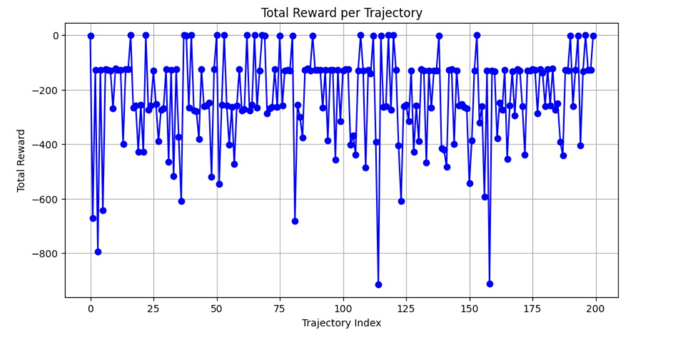
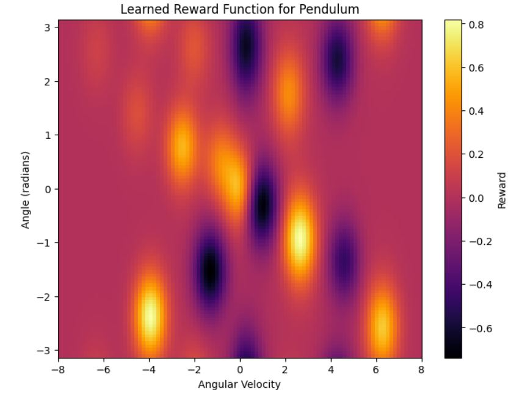

# rbf-IRL
An implementation of automated feature extraction for inverse Reinforcement Learning using radial basis functions

# Team Members

## Overview

## **Inverse Reinforcement Learning (IRL)**
is a framework where the goal is to **infer the reward function** from expert demonstrations instead of defining it explicitly. This approach is useful when designing a reward function manually is challenging or infeasible (such as automated driving and parking, where the rewards are difficult to formulate). IRL aims to recover the underlying motivations driving expert behavior, allowing the agent to learn effective policies that generalize well to new situations.

## Mathematically, IRL is formulated as follows:  
- Given a Markov Decision Process (MDP) **M = (S, A, P, r, γ)** without a known reward function **r**, the objective is to estimate **r\*** from expert trajectories **τ = {(s₀, a₀), (s₁, a₁), ...}**.  
- The inferred reward function **r\*** should explain the expert's behavior by maximizing the likelihood of observed trajectories.  

One way to solve IRL is through a **linear reward model**, where the reward function is expressed as a weighted sum of state features:  

$r(s) = w^T \phi(s)$

where:  
- $\phi(s)$ is a feature representation of state $s$,  
- $w$ is a weight vector learned to best explain the expert's behavior.  

The goal is to find $w$ such that the expected feature counts of the learned policy match those of the expert demonstrations.

### Choosing $\phi(s)$
The choice of feature representation $\phi(s)$ is crucial for effective IRL. Common approaches include:  

- **Handcrafted Features**: Domain-specific features such as velocity, energy, or angular deviation in a pendulum system.  
- **Neural Network**: Learning features automatically via deep networks for high-dimensional state spaces, require a lot of data.  
Handcrafted usually performing the best.

The ideal $\phi(s)$ should be expressive enough to capture relevant state dynamics while remaining computationally efficient.


## Problem Description  
We study a paper on **automated feature extraction for Inverse Reinforcement Learning**, where they use **polynomial features up to the second degree** derived from the state. While polynomial features can effectively approximate the true reward function in environments like the pendulum, they may struggle with more complex dynamics.  

In this work, we propose using **Radial Basis Functions (RBFs)** as an alternative feature representation. RBFs can better capture non-linear relationships and provide a more flexible approximation of the reward function.  

### Pendulum
The pendulum environment is a classic control problem where:

- The pendulum starts in a random position.
- The agent must apply torque to swing it upright and keep it balanced.
- Observations include the pendulum's angle and angular velocity.
- Actions are continuous torque values.
- The reward function is **not explicitly provided** but inferred from expert demonstrations.

We conduct experiments on the **pendulum environment**, where the reward can be perfectly represented using polynomial features, allowing us to directly compare the effectiveness of polynomial and RBF-based feature extraction for IRL.

## RBF-IRL Algorithm

### Input
- Expert demonstrations $\tau_E = \{\tau_1, \tau_2, ..., \tau_N\}$ where each $\tau_i$ is a trajectory of state-action pairs
- Number of RBF centers $k$
- Kernel width $\sigma$
- Learning rate $\alpha$
- Number of training epochs $T$
- Regularization parameter $\lambda$

### Output
- Weight vector $w$ for the reward function $r(s) = w^T \phi(s)$

### Procedure

1. **Extract all states** $S$ from expert demonstrations $\tau_E$

2. **Compute RBF centers**:
   - Apply K-means clustering to $S$ to obtain $k$ cluster centers $\{c_1, c_2, ..., c_k\}$

3. **Define the feature mapping** $\phi(s)$:
   - For a state $s$, $\phi(s) = [e^{-\|s - c_1\|^2/(2\sigma^2)}, ..., e^{-\|s - c_k\|^2/(2\sigma^2)}]$

4. **Compute expert feature expectations** $\mu_E$:
   - $\mu_E = \frac{1}{|S|} \sum_{s \in S} \phi(s)$

5. **Initialize weights** $w$ randomly

6. **For epoch = 1 to T**:
   - Train a policy $\pi$ using the current reward function $r(s) = w^T \phi(s)$
   - Generate rollouts using $\pi$
   - Compute feature expectations $\mu_\pi$ from the policy rollouts
   - Compute gradient: $g = \mu_E - \mu_\pi - 2\lambda w$ (if using L2 regularization)
   - Update weights: $w = w + \alpha g$
   - Check for convergence (optional)

7. **Return** the learned weights $w$

### Hyper Parameters
- **Number of RBF centers (k)**
- **Kernel width (σ)**
- **Learning rate (α)**
- **Number of training epochs (T)**
- **Regularization parameter (λ)**
- **Number of expert demonstrations (N)**
- **Number of rollouts per iteration**

## Requirements
- python3
- gymnasium
- torch
- numpy
- matplotlib
- stable-baselines3
- pickle
- sklearn

## Running the Project

### Step 1: Install Python

Install the latest version of Python from the official Python website.

### Step 2: Install Dependencies

Run the following command in your terminal to install the required dependencies:
```bash
pip install -r requirements.txt
```
### Step 3: Run the ipynb file

## Images

### Reward per Trajectory


### Reward Image


### Pendulum policy trained on orginal reward


### Pendulum  policy trained on inferred reward


